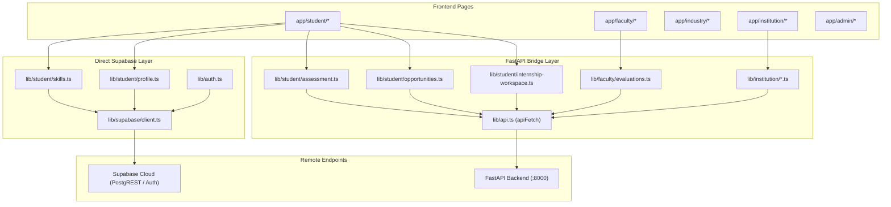
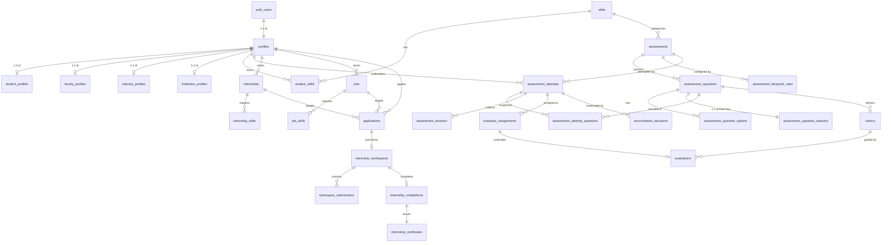

# AIC PORTAL — COMPLETE CODEBASE & ARCHITECTURE AUDIT

---

## 1. Executive Summary

This report presents an exhaustive, forensic architectural audit of the **AIC Portal (Academia-Industry Collaboration Portal)** codebase as it exists on disk at `/Users/apratimdebnath/hackheritage4`.

### Key Findings
1. **Repository Reality vs. Documentation**:
   - The root `README.md` and `docs/PROJECT_CONTEXT.md` claim the repository is an *"Environment scaffold only... business features are not implemented yet... FastAPI backend is an empty scaffold."*
   - **Current Truth**: This is severe documentation drift. The codebase has undergone extensive development across multiple branches and integration passes. It contains **83 database migrations** defining **83 distinct tables**, **44 mounted FastAPI routers** exposing **312 live endpoints**, **147 frontend test suites**, **72 backend unit test suites**, and **15 live integration test suites**.
2. **Dual-Architecture Pattern (Direct Supabase vs. FastAPI Gateway)**:
   - **Direct Supabase / PostgREST**: Authentication, user onboarding, baseline profile management (`frontend/lib/profile.ts`), student profiles (`frontend/lib/student/profile.ts`), and self-reported skills (`frontend/lib/student/skills.ts`) bypass FastAPI completely. Next.js communicates directly with Supabase via PostgREST and RLS.
   - **FastAPI Gateway (`frontend/lib/api.ts`)**: All complex domains—Assessments, Evaluations, Reconciliation, Faculty Permissions, Jobs & Internships, Applications & Matching, Digital Portfolios, Industry Portals, Institution Portals, and Workspaces—route through FastAPI. The frontend attaches the user's Supabase session Bearer JWT, which FastAPI validates and propagates to PostgreSQL via `build_user_client(token)` to preserve Row Level Security.
3. **Critical Architectural Blind Spots Discovered**:
   - **Unmounted Implemented Routers**: `backend/app/api/skill_gap.py` (7 endpoints) and `backend/app/api/analytics.py` (1 endpoint) are fully implemented with services and schemas, but were **omitted from `backend/app/main.py`**. Frontend calls to `/api/v1/job-roles`, `/api/v1/skill-gap`, and `/api/v1/analytics/industry` fail with `404 Not Found`.
   - **Unwired Industry Portal Views**: The create views and detail views for Industry Projects, Trainings, Workshops, Mentorships, and Collaborations are implemented under `frontend/components/industry/`, but their index routes (`frontend/app/industry/workshops/page.tsx`, `projects`, `training`, `mentorship`, `collaborations`, `profile`, `analytics`, `settings`) were left as static `Coming Soon` placeholders.
   - **Edge Middleware Naming Gap**: Edge authentication was placed in `frontend/proxy.ts` exporting `proxy()`, rather than Next.js convention `middleware.ts`. Next.js does not invoke `proxy.ts` at the edge; route protection relies instead on server-side Next.js App Router layouts (`student/layout.tsx`, `faculty/layout.tsx`, etc.).
   - **100% Placeholder AI Subsystem**: All files in `backend/app/ai/` are 1-line docstring stubs, `AI_API_KEY` is empty, and frontend `/ai/*` routes are static placeholders. All current matching, recommendation, and scoring systems are deterministic PostgreSQL/Python logic.

---

## 2. Repository Identity & Git State

- **Absolute Repository Path**: `/Users/apratimdebnath/hackheritage4`
- **Repository Name**: `hackheritage4` (origin: `https://github.com/Blaze-sketch-ally/hackheritage4.git`)
- **Current Git Branch**: `feature/apratim-changes-made`
- **Working Tree State**: **Clean** (no uncommitted, modified, or staged files).
- **Branch Tracking State**: Ahead of remote `origin/feature/apratim-changes-made` by **2 commits**:
  - `5dfd6e4`: `feat: integrate collaborator Institution portal, Job Training, interview fixes + student polish`
  - `ab8468a`: `feat(faculty): notifications, tasks, reconciliation + assessment recommendations`
- **Recent Git Log (Top 10 Commits)**:
  1. `5dfd6e4` - feat: integrate collaborator Institution portal, Job Training, interview fixes + student polish
  2. `ab8468a` - feat(faculty): notifications, tasks, reconciliation + assessment recommendations
  3. `b0bf35b` - feat: adopt remaining deferred features (interviews, student events, learning, recommendations)
  4. `9d3ec23` - feat: integrate collaborator branches (internships/jobs/applications, internship workspaces, mentorship discovery, portfolio achievements)
  5. `c589ad2` - feat(faculty): evaluator assignment workflow and capability-aware dashboards
  6. `ea12177` - feat(faculty): consolidate F7 review governance work
  7. `ee002e1` - feat(faculty): consolidate uncommitted faculty work
  8. `8f3ba3d` - feat(faculty): complete faculty portal and opportunities
  9. `4561e34` - feat(frontend): add Industry Portal client for projects/training/workshops/mentorship/collaborations
  10. `0147c5e` - test(backend): add coverage for the new Industry Portal modules
- **Key Remote Branches**:
  - `origin/main` (pointing to commit `16f1fd5`)
  - `origin/arunangshu-part1`
  - `origin/shatrajeet-feature`
  - `origin/feature/assessment-ui`

---

## 3. Complete Project Directory Structure

```
/Users/apratimdebnath/hackheritage4/
├── .claude/
│   └── scheduled_tasks.lock          # Local tool state lockfile
├── .github/
│   └── workflows/
│       └── ci.yml                     # GitHub Actions CI (frontend lint/test/build + backend ruff/pytest)
├── .gitignore                         # Standard gitignore (node_modules, .env, .venv, .next, etc.)
├── docker-compose.yml                 # Local dev composition (Node 20 frontend + Python 3.12 backend)
├── README.md                          # Root setup documentation (stale status note)
├── backend/                           # FastAPI Application Root
│   ├── pyproject.toml                 # Ruff configuration & lint overrides
│   ├── requirements.txt               # Production Python dependencies
│   ├── requirements-dev.txt           # Development dependencies (ruff)
│   ├── README.md                      # Backend setup and endpoint summary
│   ├── app/
│   │   ├── main.py                    # FastAPI root application, CORS, and router registration
│   │   ├── api/                       # 58 router files (44 mounted, 14 unmounted)
│   │   ├── core/                      # Configuration, dependencies, security, exceptions
│   │   ├── database/                  # Supabase clients (user-client & service-role client)
│   │   ├── schemas/                   # 43 Pydantic domain request/response schemas
│   │   ├── services/                  # 46 business logic services
│   │   ├── ai/                        # AI client and algorithm stubs (all 1-line stubs)
│   │   └── utils/                     # Scoring algorithms, validators, helpers, file utils
│   ├── scripts/                       # Maintenance & backfill utility scripts
│   └── tests/                         # 72 unit/mock test files + 15 live integration test files
├── database/                          # PostgreSQL / Supabase Schema Root
│   ├── migrations/                    # 83 ordered SQL migration files (001 to 083)
│   ├── seed/                          # Demo seed data (career roles, demo students, questions, etc.)
│   └── README.md                      # Database documentation
├── docs/                              # Architecture and Design Documentation
│   ├── PROJECT_CONTEXT.md             # Baseline project context (written during initial auth phase)
│   ├── api/api-documentation.md       # API docs (stale placeholder)
│   ├── architecture/                  # Assessment lifecycle, data flow, integration specs
│   ├── database/                      # ER diagrams & schema documentation
│   └── presentation/                  # Demo flows & problem statements
└── frontend/                          # Next.js App Router Application Root
    ├── package.json                   # Next.js 16.3.3, React 19.2.8, Tailwind CSS 4, Vitest
    ├── tsconfig.json                  # TypeScript bundler configuration, path alias '@/ -> ./*'
    ├── next.config.ts                 # Next.js configuration
    ├── postcss.config.mjs             # Tailwind CSS PostCSS plugin
    ├── vitest.config.ts               # Vitest jsdom unit test configuration
    ├── vitest.setup.ts                # Testing Library matchers setup
    ├── proxy.ts                       # Misnamed session-gating proxy (should be middleware.ts)
    ├── app/                           # Next.js App Router route hierarchy
    │   ├── (auth)/                    # Public auth pages (login, register, onboarding, etc.)
    │   ├── admin/                     # Admin portal pages and layout
    │   ├── faculty/                   # Faculty portal pages and layout
    │   ├── industry/                  # Industry portal pages and layout
    │   ├── institution/               # Institution portal pages and layout
    │   ├── student/                   # Student portal pages and layout
    │   ├── opportunities/             # Public opportunity browsing placeholders
    │   ├── collaboration/             # Public collaboration placeholders
    │   ├── ai/                        # AI tool placeholders
    │   └── auth/callback/route.ts     # Supabase Auth code exchange handler
    ├── components/                    # Modular React components
    │   ├── admin/                     # Faculty permissions & evaluator assignments views
    │   ├── auth/                      # Login, signup, password reset forms
    │   ├── faculty/                   # Studio, questions, evaluations, reconciliations
    │   ├── industry/                  # Job/internship postings, applicants, workspaces
    │   ├── institution/               # Placement drives, department directory, partnerships
    │   ├── student/                   # Assessment taker, skill gap, workspaces, portfolio
    │   └── ui/                        # Radix/Base-UI primitive wrappers
    ├── hooks/                         # React hooks (use-auth, use-user, use-skills, etc.)
    ├── lib/                           # Frontend service layers (student, faculty, industry, institution)
    └── types/                         # TypeScript domain contracts mirroring schemas
```

---

## 4. Logical Architecture

```
                                  [ Browser User Client ]
                                             │
                      ┌──────────────────────┴──────────────────────┐
                      ▼                                             ▼
          [ Next.js App Router UI ]                         [ Supabase Auth ]
       (React 19 / Tailwind / Radix)                       (OAuth / Passwords)
                      │                                             │
         ┌────────────┴────────────┐                                │ User JWT
         ▼                         ▼                                ▼
   [ Direct PostgREST ]    [ lib/api.ts Bridge ] ──────────────────────────┐
   - profiles              (Bearer Token Auth)                             │
   - student_profiles              │                                       │
   - student_skills                ▼                                       │
         │                 [ FastAPI Application ] <───────────────────────┘
         │                 ├── app.core.dependencies (Token & Role Verification)
         │                 ├── Router Layer (44 Mounted Routers)
         │                 └── Service Layer (Business Logic & Scoring)
         │                         │
         │            ┌────────────┴────────────┐
         │            ▼                         ▼
         │   [ build_user_client() ]   [ get_supabase() ]
         │   (Anon Key + User JWT)     (Service Role Bypass)
         │   - RLS Enforced            - Privileged Scored Submissions
         │   - User-scoped queries     - Automated Workspace Provisioning
         │            │                         │
         └────────────┼─────────────────────────┘
                      ▼
         [ PostgreSQL 15+ (Supabase) ]
         ├── Row Level Security (RLS) Policies
         ├── Triggers (Immutability, Transitions, Audit)
         └── SECURITY DEFINER Functions & RPCs
```

---

## 5. Technology Stack

### Frontend
- **Framework**: Next.js 16.3.3 (App Router, Server & Client Components)
- **UI Runtime**: React 19.2.8 & React DOM 19.2.8
- **Styling**: Tailwind CSS v4 (`@tailwindcss/postcss`), `clsx`, `tailwind-merge`
- **Component Primitives**: `@base-ui/react` (v1.7.0), `class-variance-authority`, `lucide-react` (v1.35.0)
- **Data Visualization**: `recharts` (v3.10.1)
- **Supabase SDKs**: `@supabase/ssr` (v0.12.5), `@supabase/supabase-js` (v2.112.4)
- **Testing**: Vitest 4.1.11, `@testing-library/react` (v16.3.3), `@testing-library/jest-dom` (v7.0.1), `jsdom` (v26.1.0)

### Backend
- **Framework**: FastAPI (ASGI application)
- **Server**: Uvicorn (`uvicorn[standard]`)
- **Language / Runtime**: Python 3.11 / 3.12
- **Data Modeling & Validation**: Pydantic v2 & `pydantic-settings`
- **Database Client**: `supabase-py` (v2), `postgrest-py`, `supabase-auth`
- **HTTP Client**: `httpx`
- **Testing & Tooling**: `pytest`, `ruff` (v0.16.5)

### Database & Cloud
- **Database Engine**: PostgreSQL 15+ hosted on Supabase
- **Authentication**: Supabase Auth (GoTrue) supporting Email/Password and Google OAuth2
- **Storage**: Supabase Storage

---

## 6. Frontend Architecture

### State Management & Data Fetching
- **Server Components**: Used for outer route layouts (`student/layout.tsx`, `faculty/layout.tsx`, `industry/layout.tsx`, `institution/layout.tsx`, `admin/layout.tsx`) to perform server-side authentication and role verification before streaming children.
- **Client Components (`"use client"`)**: Used for all interactive pages, forms, and data grids.
- **Client Data Fetching Pattern**: React `useEffect` + `useState` hooks calling typed library functions in `frontend/lib/`. No global external store (e.g. Redux or Zustand) is installed; state is localized to feature shells and view models.

---

## 7. Frontend Route Map

| Route | File Path | Type | Access | Required Role | Function & Status |
|---|---|---|---|---|---|
| `/` | `app/page.tsx` | Server | Public | None | Marketing landing page (**IMPLEMENTED**) |
| `/login` | `app/(auth)/login/page.tsx` | Client | Public | None | Email/Password and Google OAuth sign-in (**IMPLEMENTED**) |
| `/register` | `app/(auth)/register/page.tsx` | Client | Public | None | Account creation with full name and username (**IMPLEMENTED**) |
| `/forgot-password` | `app/(auth)/forgot-password/page.tsx` | Client | Public | None | Password reset request form (**IMPLEMENTED**) |
| `/reset-password` | `app/(auth)/reset-password/page.tsx` | Client | Public | None | Session-gated password update form (**IMPLEMENTED**) |
| `/verify-email` | `app/(auth)/verify-email/page.tsx` | Client | Public | None | Post-registration verification confirmation (**IMPLEMENTED**) |
| `/onboarding` | `app/(auth)/onboarding/page.tsx` | Client | Authenticated | None (Sets role) | First-login role selection (excludes ADMIN) (**IMPLEMENTED**) |
| `/auth/callback` | `app/auth/callback/route.ts` | Route Handler | Public | None | OAuth & email link code exchange (**IMPLEMENTED**) |
| `/student/dashboard` | `app/student/dashboard/page.tsx` | Client | Protected | `STUDENT` | Main student dashboard with KPI cards (**IMPLEMENTED**) |
| `/student/profile` | `app/student/profile/page.tsx` | Client | Protected | `STUDENT` | Academic, bio, and goal management (**IMPLEMENTED**) |
| `/student/skills` | `app/student/skills/page.tsx` | Client | Protected | `STUDENT` | Self-reported skills catalog CRUD (**IMPLEMENTED**) |
| `/student/assessment` | `app/student/assessment/page.tsx` | Client | Protected | `STUDENT` | Available assessments list (**IMPLEMENTED**) |
| `/student/assessment/[id]` | `app/student/assessment/[id]/page.tsx` | Client | Protected | `STUDENT` | Assessment taker & live scoring view (**IMPLEMENTED**) |
| `/student/skill-gap` | `app/student/skill-gap/page.tsx` | Client | Protected | `STUDENT` | Career role target & gap analysis (**PARTIAL - Backend 404**) |
| `/student/career` | `app/student/career/page.tsx` | Server | Protected | `STUDENT` | Student career navigation (**COMING SOON STUB**) |
| `/student/internships` | `app/student/internships/page.tsx` | Client | Protected | `STUDENT` | Browse published internships (**IMPLEMENTED**) |
| `/student/internships/[id]` | `app/student/internships/[id]/page.tsx` | Client | Protected | `STUDENT` | Internship detail, match score & apply (**IMPLEMENTED**) |
| `/student/jobs` | `app/student/jobs/page.tsx` | Client | Protected | `STUDENT` | Browse published jobs (**IMPLEMENTED**) |
| `/student/jobs/[id]` | `app/student/jobs/[id]/page.tsx` | Client | Protected | `STUDENT` | Job detail, match score & apply (**IMPLEMENTED**) |
| `/student/applications` | `app/student/applications/page.tsx` | Client | Protected | `STUDENT` | Applications tracker & withdrawal (**IMPLEMENTED**) |
| `/student/portfolio` | `app/student/portfolio/page.tsx` | Client | Protected | `STUDENT` | Digital portfolio overview (**IMPLEMENTED**) |
| `/student/projects` | `app/student/projects/page.tsx` | Client | Protected | `STUDENT` | Portfolio project CRUD (**IMPLEMENTED**) |
| `/student/certifications` | `app/student/certifications/page.tsx` | Client | Protected | `STUDENT` | Portfolio certification CRUD (**IMPLEMENTED**) |
| `/student/achievements` | `app/student/achievements/page.tsx` | Client | Protected | `STUDENT` | Portfolio achievements list (**IMPLEMENTED**) |
| `/student/my-internships` | `app/student/my-internships/page.tsx` | Client | Protected | `STUDENT` | Active internship workspaces list (**IMPLEMENTED**) |
| `/student/my-internships/[id]` | `app/student/my-internships/[id]/page.tsx` | Client | Protected | `STUDENT` | Workspace view & assignment list (**IMPLEMENTED**) |
| `/student/my-internships/[id]/assignments/[assignmentId]` | `.../page.tsx` | Client | Protected | `STUDENT` | Submit assignment deliverables (**IMPLEMENTED**) |
| `/student/job-training` | `app/student/job-training/page.tsx` | Client | Protected | `STUDENT` | Enrolled job training modules (**IMPLEMENTED**) |
| `/student/job-training/[enrollmentId]` | `.../page.tsx` | Client | Protected | `STUDENT` | Job training program detail & progress (**IMPLEMENTED**) |
| `/student/events` | `app/student/events/page.tsx` | Client | Protected | `STUDENT` | Institution & industry event list (**IMPLEMENTED**) |
| `/student/events/[id]` | `app/student/events/[id]/page.tsx` | Client | Protected | `STUDENT` | Event detail view (**IMPLEMENTED**) |
| `/student/learning` | `app/student/learning/page.tsx` | Client | Protected | `STUDENT` | Learning resource directory & tracker (**IMPLEMENTED**) |
| `/student/learning/[id]` | `app/student/learning/[id]/page.tsx` | Client | Protected | `STUDENT` | Learning resource viewer (**IMPLEMENTED**) |
| `/student/mentorship-opportunities` | `.../page.tsx` | Client | Protected | `STUDENT` | Industry mentorship listings (**IMPLEMENTED**) |
| `/student/mentorship` | `app/student/mentorship/page.tsx` | Client | Protected | `STUDENT` | Faculty mentorship requests (**IMPLEMENTED**) |
| `/student/institution` | `app/student/institution/page.tsx` | Client | Protected | `STUDENT` | Linked institution & link requests (**IMPLEMENTED**) |
| `/student/recommendations` | `app/student/recommendations/page.tsx` | Client | Protected | `STUDENT` | Unified opportunity & learning suggestions (**IMPLEMENTED**) |
| `/student/notifications` | `app/student/notifications/page.tsx` | Client | Protected | `STUDENT` | Student notification center (**IMPLEMENTED**) |
| `/student/settings` | `app/student/settings/page.tsx` | Server | Protected | `STUDENT` | Student account settings (**COMING SOON STUB**) |
| `/faculty/dashboard` | `app/faculty/dashboard/page.tsx` | Client | Protected | `FACULTY` | Faculty capability-aware dashboard (**IMPLEMENTED**) |
| `/faculty/profile` | `app/faculty/profile/page.tsx` | Client | Protected | `FACULTY` | Faculty profile & research areas (**IMPLEMENTED**) |
| `/faculty/assessment-studio` | `app/faculty/assessment-studio/page.tsx` | Client | Protected | `FACULTY` | Assessment management studio (**IMPLEMENTED**) |
| `/faculty/questions` | `app/faculty/questions/page.tsx` | Client | Protected | `FACULTY` | Question bank & peer review (**IMPLEMENTED**) |
| `/faculty/questions/new` | `app/faculty/questions/new/page.tsx` | Client | Protected | `FACULTY` | Question authoring interface (**IMPLEMENTED**) |
| `/faculty/questions/[id]` | `app/faculty/questions/[id]/page.tsx` | Client | Protected | `FACULTY` | Question review & details (**IMPLEMENTED**) |
| `/faculty/blueprint` | `app/faculty/blueprint/page.tsx` | Client | Protected | `FACULTY` | Assessment blueprint rule editor (**IMPLEMENTED**) |
| `/faculty/evaluation-workspace` | `.../page.tsx` | Client | Protected | `FACULTY` | Assigned student attempt evaluations (**IMPLEMENTED**) |
| `/faculty/evaluation-workspace/[id]` | `.../page.tsx` | Client | Protected | `FACULTY` | Rubric scoring & evaluation editor (**IMPLEMENTED**) |
| `/faculty/reconciliation` | `app/faculty/reconciliation/page.tsx` | Client | Protected | `FACULTY` | Discrepant evaluation case queue (**IMPLEMENTED**) |
| `/faculty/reconciliation/[attemptId]` | `.../page.tsx` | Client | Protected | `FACULTY` | Moderator reconciliation decision (**IMPLEMENTED**) |
| `/faculty/opportunities` | `app/faculty/opportunities/page.tsx` | Client | Protected | `FACULTY` | Industry/institution opportunity board (**IMPLEMENTED**) |
| `/faculty/mentorship` | `app/faculty/mentorship/page.tsx` | Client | Protected | `FACULTY` | Student mentorship management (**IMPLEMENTED**) |
| `/faculty/notifications` | `app/faculty/notifications/page.tsx` | Client | Protected | `FACULTY` | Faculty notification center (**IMPLEMENTED**) |
| `/faculty/* (other)` | `calendar`, `collaborations`, `consultancy`, `fdps`, `internships`, `research`, `settings`, `workshops` | Server | Protected | `FACULTY` | Unbuilt feature placeholders (**COMING SOON STUBS**) |
| `/industry/dashboard` | `app/industry/dashboard/page.tsx` | Client | Protected | `INDUSTRY` | Industry overview dashboard (**IMPLEMENTED**) |
| `/industry/internships` | `app/industry/internships/page.tsx` | Client | Protected | `INDUSTRY` | Internship management list (**IMPLEMENTED**) |
| `/industry/internships/create` | `app/industry/internships/create/page.tsx` | Client | Protected | `INDUSTRY` | Create internship posting (**IMPLEMENTED**) |
| `/industry/internships/[id]` | `app/industry/internships/[id]/page.tsx` | Client | Protected | `INDUSTRY` | Internship posting details (**IMPLEMENTED**) |
| `/industry/internships/[id]/program` | `.../page.tsx` | Client | Protected | `INDUSTRY` | Structured curriculum editor (**IMPLEMENTED**) |
| `/industry/internships/[id]/submissions` | `.../page.tsx` | Client | Protected | `INDUSTRY` | Review student deliverables (**IMPLEMENTED**) |
| `/industry/jobs` | `app/industry/jobs/page.tsx` | Client | Protected | `INDUSTRY` | Job management list (**IMPLEMENTED**) |
| `/industry/jobs/create` | `app/industry/jobs/create/page.tsx` | Client | Protected | `INDUSTRY` | Create job posting (**IMPLEMENTED**) |
| `/industry/jobs/[id]` | `app/industry/jobs/[id]/page.tsx` | Client | Protected | `INDUSTRY` | Job posting details (**IMPLEMENTED**) |
| `/industry/applicants` | `app/industry/applicants/page.tsx` | Client | Protected | `INDUSTRY` | Applicant funnel & match scores (**IMPLEMENTED**) |
| `/industry/interviews` | `app/industry/interviews/page.tsx` | Client | Protected | `INDUSTRY` | Scheduled interview pipeline (**IMPLEMENTED**) |
| `/industry/faculty-opportunities` | `.../page.tsx` | Client | Protected | `INDUSTRY` | Industry-faculty engagements (**IMPLEMENTED**) |
| `/industry/projects/create` | `app/industry/projects/create/page.tsx` | Client | Protected | `INDUSTRY` | Post industry live project (**IMPLEMENTED**) |
| `/industry/projects/[id]` | `app/industry/projects/[id]/page.tsx` | Client | Protected | `INDUSTRY` | Industry live project detail (**IMPLEMENTED**) |
| `/industry/projects` | `app/industry/projects/page.tsx` | Server | Protected | `INDUSTRY` | Projects index (**UNWIRED STUB - ListView exists**) |
| `/industry/workshops` | `app/industry/workshops/page.tsx` | Server | Protected | `INDUSTRY` | Workshops index (**UNWIRED STUB - ListView exists**) |
| `/industry/training` | `app/industry/training/page.tsx` | Server | Protected | `INDUSTRY` | Training index (**UNWIRED STUB - ListView exists**) |
| `/industry/mentorship` | `app/industry/mentorship/page.tsx` | Server | Protected | `INDUSTRY` | Mentorship index (**UNWIRED STUB - ListView exists**) |
| `/industry/collaborations` | `app/industry/collaborations/page.tsx` | Server | Protected | `INDUSTRY` | Collaboration index (**UNWIRED STUB - ListView exists**) |
| `/industry/analytics` | `app/industry/analytics/page.tsx` | Server | Protected | `INDUSTRY` | Analytics index (**UNWIRED STUB - Backend 404**) |
| `/industry/profile` | `app/industry/profile/page.tsx` | Server | Protected | `INDUSTRY` | Company profile index (**UNWIRED STUB - View exists**) |
| `/institution/dashboard` | `app/institution/dashboard/page.tsx` | Client | Protected | `INSTITUTION` | Institution administration overview (**IMPLEMENTED**) |
| `/institution/students` | `app/institution/students/page.tsx` | Client | Protected | `INSTITUTION` | Enrolled student directory (**IMPLEMENTED**) |
| `/institution/students/[id]` | `app/institution/students/[id]/page.tsx` | Client | Protected | `INSTITUTION` | Student profile & dept assignment (**IMPLEMENTED**) |
| `/institution/departments` | `app/institution/departments/page.tsx` | Client | Protected | `INSTITUTION` | Academic departments directory (**IMPLEMENTED**) |
| `/institution/industry-partners` | `.../page.tsx` | Client | Protected | `INSTITUTION` | Partner companies & internships (**IMPLEMENTED**) |
| `/institution/placements` | `app/institution/placements/page.tsx` | Client | Protected | `INSTITUTION` | Placement drive management (**IMPLEMENTED**) |
| `/institution/reports` | `app/institution/reports/page.tsx` | Client | Protected | `INSTITUTION` | Analytics export and CSV generation (**IMPLEMENTED**) |
| `/institution/skill-gaps` | `app/institution/skill-gaps/page.tsx` | Client | Protected | `INSTITUTION` | Cohort skill gap analysis (**IMPLEMENTED**) |
| `/admin/faculty` | `app/admin/faculty/page.tsx` | Client | Protected | `ADMIN` | Faculty permission management (**IMPLEMENTED**) |
| `/admin/assessments` | `app/admin/assessments/page.tsx` | Client | Protected | `ADMIN` | Evaluator assignment console (**IMPLEMENTED**) |
| `/admin/* (other)` | `dashboard`, `institutions`, `companies`, `reports`, `settings`, `skills`, `students`, `users`, `verification` | Server | Protected | `ADMIN` | Stubs (**COMING SOON STUBS**) |
| `/certificates/verify/[number]` | `.../page.tsx` | Client | Public | None | Public certificate verification (**IMPLEMENTED**) |

---

## 8. Frontend Module-by-Module Analysis

### Core Client Infrastructure
1. `frontend/lib/api.ts`:
   - **Type**: API Gateway wrapper (Client Component only).
   - **Exports**: `apiFetch<T>`, `api` object (`get`, `post`, `put`, `patch`, `delete`), `ApiError`, `getAccessToken`.
   - **Behavior**: Retrieves JWT from browser Supabase client via `supabase.auth.getSession()`, injects `Authorization: Bearer <token>`, targets `NEXT_PUBLIC_API_URL` (default `http://localhost:8000`), handles non-2xx responses and 204 No Content.
2. `frontend/lib/supabase/client.ts`:
   - **Type**: Browser Supabase Client Singleton.
   - **Exports**: `createClient()`.
   - **Behavior**: Initializes Supabase browser client with `NEXT_PUBLIC_SUPABASE_URL` and `NEXT_PUBLIC_SUPABASE_ANON_KEY`.
3. `frontend/lib/supabase/server.ts`:
   - **Type**: Server Component Supabase Client Factory.
   - **Exports**: `createClient()`.
   - **Behavior**: Initializes Supabase server client using `@supabase/ssr` with Next.js cookie store integration.

### Domain Service Libraries
- `frontend/lib/student/assessment.ts`: Wrapper for `/api/v1/assessments`, `/attempts`, question fetching, answer saving, attempt submission, and score retrieval.
- `frontend/lib/student/skills.ts`: Direct Supabase client queries against `skill_categories`, `skills`, and `student_skills`. Completely bypasses FastAPI.
- `frontend/lib/student/profile.ts`: Direct Supabase queries against `student_profiles`. Implements `getProfileCompletion()`.
- `frontend/lib/student/opportunities.ts`: FastAPI client for student opportunity discovery, advisory match scoring, and applications.
- `frontend/lib/student/internship-workspace.ts`: FastAPI client for student workspace acceptance, deliverables submission, and completion tracking.
- `frontend/lib/student/skill-gap.ts`: FastAPI client calling `/api/v1/job-roles` and `/api/v1/skill-gap`. *(Fails at runtime due to unmounted router in `main.py`)*.
- `frontend/lib/faculty/capabilities.tsx`: Evaluates and caches faculty permissions (`author`, `reviewer`, `evaluator`, `moderator`, `lead`, `mentor`).
- `frontend/lib/faculty/evaluations.ts`: API client for assigned student question evaluations, rubric scoring, and status transitions.
- `frontend/lib/faculty/reconciliation.ts`: API client for moderator reconciliation queue and decision submissions.
- `frontend/lib/institution/`: Suite of API client modules covering departments, students, placements, analytics, and CSV exports.

---

## 9. Frontend Dependency / Import Relationships



---

## 10. Authentication Architecture

1. **Identity Provider**: Supabase Auth (GoTrue).
2. **Registration Flow**:
   - `frontend/lib/auth.ts` `signUpWithEmail`: registers user with email, password, and user metadata (`full_name`, `username`).
   - Database trigger `on_auth_user_created` (`001_profiles.sql:L69-L71`) executes `handle_new_user()`, automatically inserting a row into `public.profiles` with `role = NULL`.
3. **Login Flow**:
   - Supported via email or username.
   - Username resolution: `signInWithIdentifier` calls PostgreSQL RPC `public.get_email_for_identifier(identifier)` (`001_profiles.sql:L78`), a `SECURITY DEFINER` function allowing anonymous resolution without exposing the profiles table.
   - Calls `supabase.auth.signInWithPassword({ email, password })`.
4. **Google OAuth Flow**:
   - Initiated via `signInWithGoogle` (`queryParams: { prompt: "select_account" }`).
   - Redirects to `app/auth/callback/route.ts` with `?code=`.
   - Exchange code for session via `supabase.auth.exchangeCodeForSession(code)`.
   - Auto-syncs username from metadata via `syncProfileUsernameFromMetadata()`.
5. **Onboarding & Role Assignment**:
   - Brand-new users land on `/onboarding` because `profile.role` is `NULL`.
   - User selects a role (`STUDENT`, `FACULTY`, `INDUSTRY`, `INSTITUTION`).
   - `updateProfileRole` updates `profiles.role`.
   - **Security Invariant**: Database trigger `prevent_unauthorized_role_change_trigger` (`023_role_and_attempt_integrity_hardening.sql:L74`) permits role assignment **only once, from NULL**. Once set, it cannot be modified by ordinary users. `ADMIN` self-assignment is permanently blocked.

---

## 11. Authorization & Role Architecture

Authorization is enforced in three distinct architectural layers:

1. **Frontend Server Layout Gates**:
   - All role-prefixed route trees are wrapped in an async Server Component layout:
     - `frontend/app/student/layout.tsx`: Checks `user.id`, loads `profiles.role`, redirects if `role !== 'STUDENT'`.
     - `frontend/app/faculty/layout.tsx`: Requires `role === 'FACULTY'`.
     - `frontend/app/industry/layout.tsx`: Requires `role === 'INDUSTRY'`.
     - `frontend/app/institution/layout.tsx`: Requires `role === 'INSTITUTION'`.
     - `frontend/app/admin/layout.tsx`: Requires `role === 'ADMIN'`.
2. **FastAPI Application Layer Dependencies (`backend/app/core/dependencies.py`)**:
   - `get_current_user`: Resolves token via `verify_access_token(token)` and queries `profiles.role` via `build_user_client(token)`.
   - `require_student`: Raises 403 Forbidden if `role != 'STUDENT'`.
   - `require_faculty`, `require_industry`, `require_institution`, `require_admin`.
   - Granular Faculty Capability Dependencies: `require_assessment_author`, `require_assessment_reviewer`, `require_assessment_evaluator`, `require_assessment_moderator`, `require_assessment_lead`, `require_mentor_capability`.
3. **Database RLS Policies & Triggers**:
   - Database security is completely independent of the application layer.
   - Helper functions: `public.is_student(auth.uid())`, `public.is_faculty(auth.uid())`, `public.is_industry(auth.uid())`, `public.is_institution(auth.uid())`, `public.is_admin(auth.uid())`.

---

## 12. Backend Architecture

### Directory Structure & Organization
- `backend/app/api/`: FastAPI route controllers.
- `backend/app/core/`: Application settings (`config.py`), security handlers (`security.py`), auth dependencies (`dependencies.py`).
- `backend/app/schemas/`: Pydantic v2 domain models for strict request validation and serialization.
- `backend/app/services/`: Stateless business logic, database queries, and deterministic calculation engines.
- `backend/app/database/`: Supabase connection management.
- `backend/app/utils/`: Mathematical scoring utilities and validation helpers.

### Token Verification & Dual-Client Security Model
- **Token Verification**: Handled by `app.core.security.verify_access_token` using `client.auth.get_user(access_token)`. Validates live with Supabase Auth to guarantee token freshness and catch revocations.
- **User Scoped Client**: `build_user_client(access_token)`. Uses the anon public key and sets PostgREST auth header. **Enforces all PostgreSQL RLS policies.**
- **Service Role Client**: `get_supabase()`. Bypasses RLS. Reserved exclusively for trusted transactional RPCs (scoring, submissions, system provisioning).

---

## 13. Complete FastAPI Endpoint Inventory

The backend contains **320 total endpoints** across all files:
- **Root Endpoints**: 2 (`GET /`, `GET /health` in `main.py`)
- **Mounted Endpoints**: 310 endpoints across 44 mounted routers.
- **Unmounted Endpoints**: 8 endpoints across 2 implemented but unmounted routers (`skill_gap.py` [7], `analytics.py` [1]).
- **Empty Scaffolds**: 12 unmounted router files with 0 endpoints.

### Representative Mounted Endpoint Sample

| Method | Path | Router File | Function | Auth Guard | Client Mode |
|---|---|---|---|---|---|
| `GET` | `/health` | `main.py` | `health_check` | None | Public |
| `GET` | `/api/v1/assessments` | `assessments.py` | `list_assessments` | `get_current_user` | User Client (RLS) |
| `POST` | `/api/v1/assessments/{id}/attempts` | `assessments.py` | `create_attempt` | `require_student` | Service Role RPC |
| `GET` | `/api/v1/attempts/{id}/questions` | `attempts.py` | `get_attempt_questions` | `require_student` | User Client (RLS) |
| `POST` | `/api/v1/attempts/{id}/answers` | `attempts.py` | `save_answer` | `require_student` | User Client (RLS) |
| `POST` | `/api/v1/attempts/{id}/submit` | `attempts.py` | `submit_attempt` | `require_student` | User Client (RLS) |
| `POST` | `/api/v1/attempts/{id}/score` | `attempts.py` | `score_attempt` | `require_student` | Service Role RPC |
| `GET` | `/api/v1/attempts/{id}/result` | `attempts.py` | `get_attempt_result` | `require_student` | User Client (RLS) |
| `GET` | `/api/v1/questions` | `questions.py` | `list_questions` | `require_faculty` | User Client (RLS) |
| `POST` | `/api/v1/questions` | `questions.py` | `create_question` | `require_assessment_author` | User Client (RLS) |
| `POST` | `/api/v1/questions/{id}/review` | `questions.py` | `review_question` | `require_assessment_reviewer` | User Client (RLS) |
| `GET` | `/api/v1/faculty/evaluations` | `faculty_evaluations.py` | `list_evaluations` | `require_assessment_evaluator` | User Client (RLS) |
| `GET` | `/api/v1/faculty/reconciliation/cases` | `faculty_reconciliation.py` | `list_cases` | `require_assessment_moderator` | User Client (RLS) |
| `POST` | `/api/v1/faculty/reconciliation/decisions` | `faculty_reconciliation.py` | `create_decision` | `require_assessment_moderator` | User Client (RLS) |
| `GET` | `/api/v1/admin/faculty/permissions` | `admin_faculty.py` | `list_faculty_permissions` | `require_admin` | User Client (RLS) |
| `POST` | `/api/v1/admin/evaluator-assignments` | `admin_evaluator_assignments.py` | `create_assignment` | `require_admin` | User Client (RLS) |
| `GET` | `/api/v1/student/opportunities` | `student_opportunities.py` | `list_opportunities` | `require_student` | User Client (RLS) |
| `GET` | `/api/v1/student/opportunities/{id}/match` | `student_opportunities.py` | `get_match` | `require_student` | User Client (RLS) |
| `POST` | `/api/v1/student/opportunities/{id}/applications` | `student_opportunities.py` | `apply` | `require_student` | User Client (RLS) |
| `POST` | `/api/v1/internships` | `internships.py` | `create_internship` | `require_industry` | User Client (RLS) |
| `POST` | `/api/v1/jobs` | `jobs.py` | `create_job` | `require_industry` | User Client (RLS) |
| `GET` | `/api/v1/applications` | `applications.py` | `list_applications` | `require_industry` | User Client (RLS) |
| `GET` | `/api/v1/institution/overview` | `institution.py` | `get_overview` | `require_institution` | User Client (RLS) |

---

## 14. Frontend ↔ Backend Integration

1. **Authentication Propagation**:
   - The browser calls `frontend/lib/api.ts:apiFetch()`.
   - Reads the active JWT from Supabase session storage.
   - Attaches `Authorization: Bearer <token>`.
   - FastAPI dependency `app.core.dependencies.get_current_user` extracts the token, verifies it against Supabase Auth, queries the caller's profile role, and injects a `CurrentUser` dataclass.
2. **Pydantic / TypeScript Data Contracts**:
   - **Decimal Serialization Invariant**: Fields representing score marks (`score`, `total_marks`, `percentage`, `points`, `awarded_marks`) are modeled in Pydantic as `Decimal` and serialized across the wire as **JSON strings** (e.g. `"score": "40.0"`). Frontend types in `frontend/types/assessment.ts` type them strictly as `string` to prevent IEEE floating-point distortion.
3. **CORS Configuration**:
   - `backend/app/main.py:L54-L60` configures `CORSMiddleware` with `allow_origins=[settings.frontend_url]`, `allow_credentials=True`.

---

## 15. Supabase Integration

1. **Client Isolation**:
   - **Browser Client**: Initialized in `frontend/lib/supabase/client.ts` using `NEXT_PUBLIC_SUPABASE_URL` and `NEXT_PUBLIC_SUPABASE_ANON_KEY`.
   - **Server Client**: Initialized in `frontend/lib/supabase/server.ts` using cookie storage.
   - **Backend User Client**: Initialized in `backend/app/core/security.py` using anon key with `.auth(token)`.
   - **Backend Service Role Client**: Initialized in `backend/app/database/supabase.py` using `SUPABASE_SERVICE_ROLE_KEY`. **Never exposed to frontend.**

---

## 16. Complete Database Schema

The repository defines **83 distinct tables** across 83 migrations. The major tables and their columns are:

| Table | Migration | Purpose | Primary Key | Foreign Keys | Key Constraints / RLS |
|---|---|---|---|---|---|
| `profiles` | 001, 023 | Core user identity & role | `id` (uuid) | `auth.users(id)` | RLS enabled; role locked after onboarding |
| `student_profiles` | 012, 069 | Extended student academic info | `id` (uuid) | `profiles(id)`, `institution_profiles(id)` | RLS enabled; student self-write |
| `skill_categories` | 003 | Taxonomy categories | `id` (uuid) | None | RLS enabled; public read |
| `skills` | 003 | Master skill catalog | `id` (uuid) | `skill_categories(id)` | RLS enabled; public read active |
| `student_skills` | 003, 023 | Student self-reported skills | `id` (uuid) | `profiles(id)`, `skills(id)` | Unique `(student_id, skill_id)`; trigger prevents self-verification |
| `assessments` | 004, 015 | Skill assessments container | `id` (uuid) | `skills(id)` | RLS enabled; public read active |
| `assessment_questions` | 004, 015, 044 | Question bank content | `id` (uuid) | `assessments(id)`, `profiles(id)` | Content-immutable once `APPROVED` |
| `assessment_question_options` | 004, 015 | Question options text | `id` (uuid) | `assessment_questions(id)` | Display text only; no answer flags |
| `assessment_question_answers` | 004, 015 | Correct answer key | `question_id` | `assessment_questions(id)` | Separated table; never readable by students |
| `assessment_blueprint_rules` | 015 | Difficulty & quota rules | `id` (uuid) | `assessments(id)` | Unique `(assessment_id, difficulty)` |
| `assessment_attempts` | 004, 015, 049 | Student exam attempts | `id` (uuid) | `profiles(id)`, `assessments(id)` | Partial unique index for active attempts; trigger-locked scores |
| `assessment_attempt_questions`| 015 | Attempt question snapshot | `(attempt_id, question_id)` | `attempts(id)`, `questions(id)` | Immutable historical realization |
| `assessment_answers` | 004, 023 | Student submitted answers | `id` (uuid) | `attempts(id)`, `questions(id)` | Unique `(attempt_id, question_id)`; locked upon submission |
| `career_roles` | 022 | Benchmark career positions | `id` (uuid) | None | Public read active |
| `career_role_skill_requirements`| 022 | Target skill thresholds | `id` (uuid) | `career_roles(id)`, `skills(id)` | Level 1-4, weights 1-5 |
| `internships` | 053 | Industry internship postings | `id` (uuid) | `profiles(id)` | RLS enabled; industry owner write |
| `internship_skills` | 053 | Required skills for internship | `id` (uuid) | `internships(id)`, `skills(id)` | Normalized requirements |
| `jobs` | 054 | Full-time job postings | `id` (uuid) | `profiles(id)` | RLS enabled; industry owner write |
| `job_skills` | 054 | Required skills for jobs | `id` (uuid) | `jobs(id)`, `skills(id)` | Normalized requirements |
| `applications` | 055, 056 | Applications for jobs/internships | `id` (uuid) | `profiles(id)`, `internships(id)`, `jobs(id)` | Check: exactly one of internship_id or job_id set |
| `interviews` | 063, 083 | Recruitment interviews | `id` (uuid) | `applications(id)`, `profiles(id)` | Scoped to industry and applicant |
| `internship_programs` | 060 | Structured milestone program | `id` (uuid) | `internships(id)` | 1:1 with internship posting |
| `internship_workspaces` | 061 | Live student work environment | `id` (uuid) | `applications(id)`, `internships(id)` | 1:1 with selected application |
| `workspace_submissions` | 062 | Student deliverable uploads | `id` (uuid) | `internship_workspaces(id)` | Deliverable review and approval |
| `internship_completions` | 062 | Verified completion record | `id` (uuid) | `internship_workspaces(id)` | Generates verifiable certificate |
| `internship_certificates` | 062 | Public verifiable credential | `id` (uuid) | `internship_completions(id)` | Unique certificate number |
| `evaluator_assignments` | 045 | Faculty grading assignments | `id` (uuid) | `attempts(id)`, `questions(id)`, `profiles(id)` | Partial unique index per evaluator |
| `rubrics` | 045 | Question grading rubrics | `id` (uuid) | `assessment_questions(id)` | Rubric criteria definitions |
| `evaluations` | 045, 049 | Human evaluator marks | `id` (uuid) | `evaluator_assignments(id)`, `rubrics(id)` | Status: DRAFT -> SUBMITTED -> FINALIZED |
| `reconciliation_decisions` | 068 | Moderator dispute resolution | `id` (uuid) | `attempts(id)`, `questions(id)`, `profiles(id)` | Append-only supersession model |
| `portfolio_projects` | 025 | Student projects showcase | `id` (uuid) | `profiles(id)` | RLS enabled; owner manage |
| `portfolio_certifications` | 025 | Student certifications | `id` (uuid) | `profiles(id)` | RLS enabled; owner manage |
| `student_achievements` | 052 | Badges & milestone achievements| `id` (uuid) | `profiles(id)` | System awarded |
| `institution_profiles` | 069 | University / college tenant | `id` (uuid) | `profiles(id)` | Tenancy anchor for institutions |
| `institution_link_requests` | 070 | Student affiliation request | `id` (uuid) | `profiles(id)`, `institution_profiles(id)` | Approved links set student institution |
| `departments` | 072 | Academic department catalog | `id` (uuid) | `institution_profiles(id)` | Institution tenancy scoped |
| `placement_drives` | 073 | On-campus placement events | `id` (uuid) | `institution_profiles(id)`, `jobs(id)` | Multi-department eligible |
| `job_programs` | 081 | Job training curriculums | `id` (uuid) | `jobs(id)` | Industry job training tracks |
| `job_training_enrollments` | 081 | Student job training track | `id` (uuid) | `job_programs(id)`, `profiles(id)` | Student enrolled training |
| `job_training_completions` | 082 | Completed training record | `id` (uuid) | `job_training_enrollments(id)` | Training certificate anchor |

---

## 17. Database Relationship / ER Analysis



---

## 18. RLS Policies

All production tables have `ALTER TABLE <name> ENABLE ROW LEVEL SECURITY;`.
- **`profiles`**:
  - `SELECT`: `auth.uid() = id` (or granted via RPCs for specific names).
  - `UPDATE`: `auth.uid() = id` (guarded by `prevent_unauthorized_role_change_trigger`).
- **`assessment_questions`**:
  - `SELECT`: `review_status = 'APPROVED'` visible to authenticated users during attempts; authors view their own questions; reviewers holding `assessment_reviewer` view pending questions (`041_assessment_capability_authorization.sql`); assigned evaluators view assigned questions (`047_evaluator_question_visibility.sql`).
- **`assessment_question_answers`**:
  - `SELECT`: **Revoked from all student roles.** Only question author, authorized reviewers, or `service_role` may select.
- **`assessment_attempts`**:
  - `SELECT`: `student_id = auth.uid()`. Evaluators can view attempts matching their active assignments (`046_evaluator_answer_access.sql`).
- **`applications`**:
  - `SELECT`: Student can view where `student_id = auth.uid()`; Industry can view where `industry_id = auth.uid()`.
- **`portfolio_projects` / `certifications`**:
  - `SELECT`: Owner student, plus industry partners who have received an active application from that student (`058_fix_portfolio_industry_view_after_applications_migration.sql`).

---

## 19. Database Functions / RPCs

| Function Name | Security Model | Target Table(s) | Purpose |
|---|---|---|---|
| `public.handle_new_user()` | `SECURITY DEFINER` | `profiles` | Auto-creates profile row upon Auth sign-up |
| `public.get_email_for_identifier(text)` | `SECURITY DEFINER` | `profiles` | Anonymous username-to-email resolution |
| `public.create_assessment_attempt(uuid, uuid)` | `SECURITY DEFINER` | `assessment_attempts`, `assessment_attempt_questions` | Atomic attempt creation & randomized blueprint snapshot (**service_role only**) |
| `public.score_assessment_attempt(uuid, uuid)` | `SECURITY DEFINER` | `assessment_attempts`, `assessment_answers` | Evaluates objective answers against key and records final percentage (**service_role only**) |
| `public.review_question(...)` | `SECURITY DEFINER` | `assessment_questions` | Peer faculty approval/rejection RPC |
| `public.fold_in_attempt_evaluation(uuid)` | `SECURITY DEFINER` | `assessment_attempts`, `evaluations` | Blends finalized evaluator marks into final score |
| `public.create_reconciliation_decision(...)` | `SECURITY DEFINER` | `reconciliation_decisions`, `assessment_attempts` | Records moderator override for conflicting evaluations |
| `public.verify_internship_certificate(text)` | `SECURITY DEFINER` | `internship_certificates` | Public certificate verification lookup |
| `public.verify_job_training_certificate(text)`| `SECURITY DEFINER` | `job_training_certificates` | Public job training credential verification |

---

## 20. Database Triggers

1. **Role Protection**:
   - `prevent_unauthorized_role_change_trigger` on `profiles`: Runs BEFORE UPDATE. Blocks non-service_role callers from promoting to `ADMIN` and restricts role mutation to once-only from NULL (`023_role_and_attempt_integrity_hardening.sql:L74`).
2. **Skill Verification Tamper Proofing**:
   - `student_skills_prevent_self_verification` on `student_skills`: Runs BEFORE UPDATE. Rejects any attempt by students to set `is_verified = true` (`003_skills.sql:L84`).
3. **Assessment Attempt Integrity**:
   - `prevent_self_attempt_scoring_trigger` on `assessment_attempts`: Runs BEFORE UPDATE. Blocks direct modification of `score`, `total_marks`, `percentage`, `status = 'COMPLETED'`, `assessment_id`, and completed attempt timestamps (`023_role_and_attempt_integrity_hardening.sql:L138`).
4. **Answer Immutability & Scoring Guard**:
   - `prevent_self_answer_scoring_trigger` on `assessment_answers`: Runs BEFORE UPDATE. Blocks direct manipulation of `awarded_marks`, `is_correct`, or changing `attempt_id` / `question_id` (`023_role_and_attempt_integrity_hardening.sql:L188`).
5. **Approved Question Content Immutability**:
   - `enforce_question_immutability` on `assessment_questions`: Runs BEFORE UPDATE. Forbids changing question text, options, or answer keys once `review_status = 'APPROVED'` (`015_question_bank_random_assessment.sql:L186`).
6. **Automatic Timestamps**:
   - `set_updated_at()` executed BEFORE UPDATE on every table with an `updated_at` column.

---

## 21. Database Security Model

- **Least Privilege Principle**: Anonymous callers have zero table read access except for executing specific `SECURITY DEFINER` RPCs (`get_email_for_identifier`, `verify_internship_certificate`).
- **Definer Search Paths**: All `SECURITY DEFINER` functions explicitly declare `SET search_path = ''` to prevent search path hijacking attacks.
- **Service Role Boundaries**: `service_role` is the only identity permitted to invoke attempt generation, score computation, and evaluation fold-in.

---

## 22. Assessment Architecture

```
[ Assessment ] (Container)
     │
     ├───────────────┐
     ▼               ▼
[ Question Bank ] [ Blueprint Rules ]
(assessment_questions) (difficulty, count)
     │ (Peer Review: APPROVED)
     └───────┬───────┘
             ▼
[ create_assessment_attempt() RPC ] (service_role)
             │
             ▼
[ assessment_attempt_questions ] <── IMMUTABLE SNAPSHOT
             │
             ├──────────────────────────┐
             ▼                          ▼
   [ Objective Questions ]     [ AI_EVALUATED Questions ]
             │                          │
   [ score_assessment_attempt() ]       ▼
   (Instant Objective Score)   [ Evaluator Assignments ]
             │                          │
             │                 [ Rubric Evaluation ] (Faculty)
             │                          │
             │                 [ fold_in_attempt_evaluation() ]
             │                          │
             │           (If Discrepancy > Threshold)
             │                          │
             │                          ▼
             │                 [ Reconciliation Decision ] (Moderator)
             │                          │
             └──────────────┬───────────┘
                            ▼
               [ Final Attempt Score & Marks ]
```

---

## 23. Assessment End-to-End Lifecycle

1. **Question Authoring**: Faculty author drafts question in `app/faculty/questions/new`. Row saved with `review_status = 'PENDING'`.
2. **Peer Review**: Different faculty member holding `assessment_reviewer` reviews question via `POST /api/v1/questions/{id}/review`. Transitions to `APPROVED`.
3. **Attempt Initialization**: Student triggers attempt via `POST /api/v1/assessments/{id}/attempts`. FastAPI invokes `public.create_assessment_attempt()` RPC via `service_role`. Selected questions are snapshotted into `assessment_attempt_questions`.
4. **Answer Submission**: Student submits answers via `POST /api/v1/attempts/{id}/answers`. Validated against `IN_PROGRESS` status.
5. **Objective Scoring**: Student submits attempt via `POST /api/v1/attempts/{id}/submit` followed by `score`. Evaluated against `assessment_question_answers` via `public.score_assessment_attempt()`.
6. **Subjective Evaluation & Reconciliation**: If subjective questions exist, status is marked `PENDING` until faculty evaluators submit rubric scores. If multiple evaluators disagree, status becomes `NEEDS_RECONCILIATION`, resolved by faculty moderator via `reconciliation_decisions`.

---

## 24. Skills & Skill Evidence Architecture

- **Two Distinct Skill Layers**:
  1. **Self-Reported Skills**: Stored in `student_skills` (`003_skills.sql`). Student selects proficiency (`Beginner`, `Intermediate`, `Advanced`, `Expert`). `is_verified` defaults to `false`.
  2. **Derived Skill Evidence**: Calculated deterministically by `app.services.assessment_service.get_student_skill_scores` from completed assessment attempt scores.
- **Skill Alignment Engine**: `backend/app/services/skill_alignment_service.py` takes requirement thresholds and compares against student derived scores, computing alignment percentage and status (`EXCEEDS`, `MEETS`, `PARTIAL`, `MISSING`).

---

## 25. Opportunity / Job / Internship Architecture

- **Schema Split (Migration 053 & 054)**:
  - Internships live in `internships` + `internship_skills`.
  - Jobs live in `jobs` + `job_skills`.
  - The older unified `opportunities` table from `024_opportunities_and_applications.sql` is retired.
- **Student Discovery**:
  - Unified browsing via `backend/app/api/student_opportunities.py` (`GET /api/v1/student/opportunities`), which aggregates active rows from both `internships` and `jobs`.

---

## 26. Application Architecture

- **Unified Application Tracking (`055_applications.sql`)**:
  - Table `applications` has columns `internship_id` and `job_id` with constraint `applications_opportunity_matches_type` ensuring exactly one is populated.
  - Lifecycle: `APPLIED` → `UNDER_REVIEW` → `SHORTLISTED` → `INTERVIEW_SCHEDULED` → `SELECTED` / `REJECTED` / `WITHDRAWN`.
  - Match Score: Computed deterministically by `app.services.match_service.py` upon submission.

---

## 27. Portfolio Architecture

- **Components**:
  - Projects: `portfolio_projects` (title, description, project_url, github_url, skills, start/end date).
  - Certifications: `portfolio_certifications` (name, issuing_organization, issue_date, credential_id, credential_url).
  - Achievements: `student_achievements` (milestones, completion badges).
- **Recruiter Access Policy**: Employers can view applicant portfolios only if the student has an active application submitted to that employer (`058_fix_portfolio_industry_view_after_applications_migration.sql`).

---

## 28. Faculty / Evaluation Architecture

- **Granular Capabilities (`041_assessment_capability_authorization.sql`)**:
  - `AUTHOR`: Can author and edit question bank questions.
  - `REVIEWER`: Can perform peer reviews on other faculty members' questions.
  - `EVALUATOR`: Can grade student subjective answers against assigned rubrics.
  - `MODERATOR`: Can resolve reconciliation disputes.
  - `LEAD`: Can configure assessment blueprints.
  - `MENTOR`: Can accept and mentor students (`039_faculty_mentor_permissions.sql`).

---

## 29. Institution Architecture

- **Tenancy Anchor**: `institution_profiles` (`069_institution_tenancy.sql`).
- **Student Affiliation**: Handled via `institution_link_requests` (`070_institution_link_requests.sql`). Approved requests link `student_profiles.institution_id`.
- **Core Modules**: Department management (`departments`), campus placement drives (`placement_drives`), industry partners (`institution_industry_partners`), and cohort skill-gap analytics (`institution_skill_gap`).

---

## 30. Industry Architecture

- **Core Capabilities**:
  - Post and manage internships and jobs.
  - Define structured internship curriculums (`internship_programs`).
  - Manage student internship workspaces (`internship_workspaces`).
  - Review deliverables, verify completions, and issue certificates (`internship_certificates`).
  - Schedule and manage candidate interviews (`interviews`).

---

## 31. Admin Architecture

- **Access Guard**: `app/admin/layout.tsx` server-side gate (`role === 'ADMIN'`).
- **Implemented Subsystems**:
  - Faculty Permission Console: `frontend/app/admin/faculty/page.tsx` backed by `backend/app/api/admin_faculty.py`.
  - Evaluator Assignment Console: `frontend/app/admin/assessments/page.tsx` backed by `backend/app/api/admin_evaluator_assignments.py`.
- **All other admin pages** (`users`, `companies`, `reports`, `settings`, etc.) are static `Coming Soon` placeholders.

---

## 32. AI Architecture

- **Current Status**: **100% SCAFFOLDED / PLACEHOLDER**.
- **Backend**:
  - `backend/app/ai/` contains 7 files (`client.py`, `career_advisor.py`, `matching.py`, `prompts.py`, `recommendation_engine.py`, `resume_analyzer.py`, `skill_analyzer.py`), all containing 1-line docstring stubs.
  - `AI_API_KEY` in `backend/.env` is empty.
  - `backend/app/api/ai.py` is an unmounted 4-line stub.
- **Frontend**:
  - `frontend/app/ai/skill-analysis/page.tsx`, `resume-analysis`, and `career-advisor` render static `Coming Soon` placeholders.
- **Scoring / Matching Reality**: All recommendation, skill-gap, and match scoring currently running in the application are 100% deterministic algorithms implemented in Python and PostgreSQL.

---

## 33. Testing Architecture

- **Frontend**:
  - Framework: Vitest with `@testing-library/react` in `jsdom` environment.
  - Test Files: **147 test suites** located alongside components in `__tests__/`.
  - Mocks: Mocked Supabase client and fetch handlers.
- **Backend**:
  - Mocked Unit Suite: **72 test files** in `backend/tests/`. Mock Supabase client role lookup and responses using `tests/conftest.py`. Fast, zero external dependencies.
  - Live Integration Suite: **15 test files** in `backend/tests/integration/`. Opt-in via `RUN_LIVE_INTEGRATION_TESTS=1`. Runs against live Supabase project to verify real RLS policies, triggers, and RPC atomicity.

---

## 34. Environment & Deployment Architecture

- **Environment Variable Names**:
  - Frontend (`.env.local`): `NEXT_PUBLIC_SUPABASE_URL`, `NEXT_PUBLIC_SUPABASE_ANON_KEY`, `NEXT_PUBLIC_API_URL`.
  - Backend (`.env`): `SUPABASE_URL`, `SUPABASE_ANON_KEY`, `SUPABASE_SERVICE_ROLE_KEY`, `FRONTEND_URL`, `AI_API_KEY`.
- **Local Development**:
  - Frontend: `npm run dev` (port 3000).
  - Backend: `uvicorn app.main:app --reload` (port 8000).
  - Or via `docker compose up`.
- **CI Pipeline**:
  - Defined in `.github/workflows/ci.yml`. Executes on push to `main` and `feature/**`. Runs lint, unit tests, and build checks for both frontend and backend.

---

## 35. Documentation vs Actual Code Reconciliation

| Topic | Documentation Claims | Code & Database Reality | Discrepancy Severity |
|---|---|---|---|
| Project Status | "Environment scaffold only. Business features not implemented yet" (`README.md`, `docs/PROJECT_CONTEXT.md`) | 83 migrations, 83 tables, 312 live endpoints, mature student/faculty/industry/institution systems. | **CRITICAL DRIFT** |
| API Endpoints | Only `/` and `/health` exist; all routers empty placeholders (`docs/api/api-documentation.md`) | 44 mounted routers exposing 312 live endpoints across all major domains. | **CRITICAL DRIFT** |
| Opportunities Schema | Unified `opportunities` table with `opportunity_type` (`docs/database/database-design.md`, `024`) | Superseded by separate `internships` (053), `jobs` (054), and updated `applications` (055). | **MODERATE DRIFT** |
| AI Integration | LLM API integration handles matching and recommendations (`README.md`) | AI directory is empty stubs; all matching and scoring are deterministic algorithms. | **HIGH DRIFT** |
| Edge Middleware | `proxy.ts` gates unauthenticated requests (`PROJECT_CONTEXT.md`, layout comments) | File named `proxy.ts`, not `middleware.ts`. Edge middleware is dormant; gates rely on Server Component layouts. | **HIGH DRIFT** |

---

## 36. Implemented vs Partial vs Placeholder Features

### Substantially Implemented (GREEN)
- Core Authentication & Session Lifecycle (Email/Password, Google OAuth, Username resolution via RPC).
- Student Onboarding & Irreversible Role Assignment.
- Question Bank Authoring, Review Workflow & Assessment Blueprints.
- Randomized Assessment Attempt Generation & Objective Scoring.
- Faculty Subjective Question Evaluation & Rubric Scoring.
- Faculty Assessment Discrepancy Reconciliation.
- Internship & Job Posting Management (Industry side).
- Student Job & Internship Discovery, Matching, and Applications.
- Internship Programs, Structured Workspaces & Submission Reviews.
- Internship Certificate Issuance & Public Verification Lookup.
- Student Digital Portfolio (Projects, Certifications, Achievements).
- Institution Tenancy, Departments, Student Directory, and Placement Drives.
- Admin Faculty Permission Console & Evaluator Assignment Console.

### Partially Implemented (YELLOW)
- **Student Skill Gap Analysis**: Fully built in frontend and backend, but endpoint returns 404 because `skill_gap.py` is not mounted in `main.py`.
- **Industry Analytics**: Fully built in frontend and backend, but returns 404 because `analytics.py` is not mounted in `main.py`.
- **Industry Portal Index Pages**: Detail and create pages for projects, trainings, workshops, mentorships, and collaborations work, but index pages render "Coming Soon".
- **Faculty Student Mentorship**: Discovery and request workflows exist, but active messaging is minimal.

### Scaffold / Placeholder (GREY)
- Entire AI subsystem (`/ai/*` pages, `backend/app/ai/*` stubs).
- Public `/opportunities/*` and `/collaboration/*` marketing pages.
- Admin portal auxiliary modules (`companies`, `dashboard`, `institutions`, `opportunities`, `reports`, `settings`, `skills`, `students`, `users`, `verification`).
- Faculty calendar, consultancy, FDPs, research, and settings.

---

## 37. Unused / Dead / Scaffolded Code

1. **Unmounted Backend Routers**:
   - `backend/app/api/skill_gap.py`: 163 lines, 7 fully implemented endpoints. Never mounted in `main.py`.
   - `backend/app/api/analytics.py`: 41 lines, 1 fully implemented endpoint. Never mounted in `main.py`.
   - 12 empty 4-line router stubs (`ai`, `auth`, `certifications`, `collaborations`, `courses`, `mentorship`, `notifications`, `projects`, `recommendations`, `skills`, `students`, `users`).
2. **Unwired Frontend Components**:
   - `workshops-list-view.tsx`, `trainings-list-view.tsx`, `projects-list-view.tsx`, `mentorship-list-view.tsx`, `collaborations-list-view.tsx`, `industry-profile-view.tsx`, `industry-settings-view.tsx` exist under `frontend/components/industry/` but are never imported in their corresponding `app/industry/*/page.tsx`.
3. **Dormant Edge Middleware**:
   - `frontend/proxy.ts` is not named `middleware.ts` and is never executed by Next.js.
4. **Retired Migrations**:
   - `005_internships.sql` through `011_analytics.sql` are 5-line empty placeholders superseded by migrations 024+.

---

## 38. TODO / FIXME / Technical Debt

- **TODO / FIXME / HACK Count**: 0 TODOs, 0 FIXMEs, 1 historical HACK mention in docs, 64 intentional "Coming Soon" UI occurrences.
- **Database Migration Dependency Order**:
  - `003_skills.sql` and `004_assessments.sql` reference `public.set_updated_at()` and `public.is_student(uuid)` before they are defined in `012_student_profiles.sql`. Replaying migrations from scratch on a blank database fails at `003`.
- **Database Drop Table Cascade in 055**:
  - `055_applications.sql` contains `DROP TABLE IF EXISTS applications CASCADE;`. Running this against a live project destroys recruitment history.

---

## 39. Security Audit

1. **Authentication & Identity**:
   - Passwords and OAuth tokens are handled exclusively by Supabase Auth.
   - JWT tokens are validated live by FastAPI against Supabase Auth (`auth.get_user`).
2. **Role Escalation Protection**:
   - Trigger `prevent_unauthorized_role_change_trigger` prevents any user from updating their role once set, and unconditionally blocks setting `role = 'ADMIN'`.
3. **Assessment Tamper Protection**:
   - Triggers `prevent_self_attempt_scoring` and `prevent_self_answer_scoring` block direct manipulation of marks, timestamps, correctness, and statuses.
4. **Cross-Tenant Isolation in Institution & Industry**:
   - Institution endpoints query data through `build_user_client(token)` with RLS policies verifying `institution_id = auth.uid()` or via specific `SECURITY DEFINER` views.
5. **Vulnerability Analysis**:
   - *Risk*: Dormant `proxy.ts` means unauthenticated requests reach the Next.js server rendering pipeline before being blocked by Server Component layouts, rather than terminating at the Edge.
   - *Risk*: `055_applications.sql` drop table cascade could cause accidental data loss if migrations are re-run indiscriminately.

---

## 40. Data Flow Diagrams

### Dual Data Flow Architecture

```
                                  [ User Action ]
                                         │
                    ┌────────────────────┴────────────────────┐
                    ▼                                         ▼
         [ Direct PostgREST Flow ]                  [ FastAPI Gateway Flow ]
                    │                                         │
                    ▼                                         ▼
         [ lib/student/skills.ts ]                   [ lib/student/assessment.ts ]
                    │                                         │
                    ▼                                         ▼
         [ lib/supabase/client.ts ]                  [ lib/api.ts (apiFetch) ]
                    │                                (Attaches Bearer JWT)
                    ▼                                         │
        [ PostgREST (HTTPS REST) ]                            ▼
                    │                                [ FastAPI: app/api/assessments ]
                    ▼                                         │
          [ PostgreSQL RLS ]                         [ app.core.dependencies ]
                    │                                (Verify token with Supabase)
                    ▼                                         │
          [ Database Tables ]                                 ▼
                                                     [ build_user_client(token) ]
                                                              │
                                                              ▼
                                                     [ PostgreSQL RLS / RPCs ]
                                                              │
                                                              ▼
                                                     [ Database Tables ]
```

---

## 41. End-to-End Feature Flows

### 1. Student Assessment Lifecycle
1. Student accesses `/student/assessment`.
2. Frontend calls `GET /api/v1/assessments`.
3. Student clicks "Start Assessment". Frontend calls `POST /api/v1/assessments/{id}/attempts`.
4. FastAPI invokes `create_assessment_attempt` RPC using `service_role`. Random questions snapshotted into `assessment_attempt_questions`.
5. Student answers questions. Frontend calls `POST /api/v1/attempts/{id}/answers`.
6. Student submits attempt. Frontend calls `POST /api/v1/attempts/{id}/submit` followed by `score`.
7. Backend invokes `score_assessment_attempt` RPC. Score recorded in `assessment_attempts`.

### 2. Opportunity Application Flow
1. Student accesses `/student/internships/[id]`.
2. Frontend calls `GET /api/v1/student/opportunities/{id}/match`. Advisory match score returned.
3. Student clicks "Apply". Frontend calls `POST /api/v1/student/opportunities/{id}/applications`.
4. Backend computes deterministic match score via `match_service.py` and inserts row into `applications`.
5. Industry recruiter views applicant on `/industry/applicants`.

---

## 42. Architectural Invariants Future Developers Must Preserve

1. **One Source of Identity**: Supabase Auth is the single identity provider. Never implement a secondary user table or local password hashing.
2. **Service Role Isolation**: `SUPABASE_SERVICE_ROLE_KEY` must never be referenced or bundled into frontend code. In FastAPI, `get_supabase()` must only be used for trusted, non-user-scoped operations.
3. **Assessment Configuration vs. Fact**: Question bank and blueprints are mutable *configurations*. `assessment_attempt_questions` is an immutable historical *fact*. Never re-derive historical attempt questions from live configuration.
4. **Decimal String Serialization**: All assessment marks and scores must be serialized as JSON strings to avoid floating-point errors.
5. **Irreversible Role Onboarding**: Profiles role must only be assigned once from `NULL`. Never create a route allowing self-service role changes.
6. **No Direct Service-Role Deletions**: Hard deletion of applications, completed attempts, or recruitment history is strictly prohibited.

---

## 43. Current Known Limitations

1. **No Assessment Attempt Resume Endpoint**: There is currently no `GET /attempts/{id}` endpoint to resume an incomplete attempt after page refresh.
2. **AI Is Staged, Not Operational**: No actual LLM inference occurs in the app.
3. **Student Skill Gap Route Broken**: Returning 404 because `skill_gap.router` is not included in `main.py`.
4. **Industry Analytics Route Broken**: Returning 404 because `analytics.router` is not included in `main.py`.
5. **Industry List Views Disconnected**: Index views for projects, training, workshops, mentorship, and collaborations render static text instead of their existing list components.

---

## 44. Critical Gaps Before Further Development

Before implementing new features, the following maintenance tasks must be executed:
1. **Mount Missing Routers in `main.py`**:
   - Mount `skill_gap.router` (prefix `/api/v1`).
   - Mount `analytics.router` (prefix `/api/v1`).
2. **Wire Disconnected Industry Views**:
   - Replace `Coming Soon` stubs in `app/industry/{workshops,projects,training,mentorship,collaborations,profile,settings}/page.tsx` with their respective implemented `*ListView` components.
3. **Rename `proxy.ts` to `middleware.ts`**:
   - Rename `frontend/proxy.ts` to `frontend/middleware.ts` and ensure `export async function middleware(...)` is exported.
4. **Resolve Database Replay Invariant**:
   - Move helper function definitions (`set_updated_at`, `is_student`) into an early foundation migration so blank database bootstrapping succeeds.

---

## 45. Current System Maturity Matrix

| Feature Domain | Frontend | Backend | Database | RLS | Tests | Overall Status |
|---|---|---|---|---|---|---|
| Authentication & Onboarding | GREEN | GREEN | GREEN | GREEN | GREEN | **SUBSTANTIALLY IMPLEMENTED** |
| Assessment Question Bank & Blueprints | GREEN | GREEN | GREEN | GREEN | GREEN | **SUBSTANTIALLY IMPLEMENTED** |
| Assessment Taking & Objective Scoring | GREEN | GREEN | GREEN | GREEN | GREEN | **SUBSTANTIALLY IMPLEMENTED** |
| Subjective Evaluation & Rubrics | GREEN | GREEN | GREEN | GREEN | GREEN | **SUBSTANTIALLY IMPLEMENTED** |
| Assessment Discrepancy Reconciliation | GREEN | GREEN | GREEN | GREEN | GREEN | **SUBSTANTIALLY IMPLEMENTED** |
| Student Self-Reported Skills | GREEN | N/A (Direct) | GREEN | GREEN | GREEN | **SUBSTANTIALLY IMPLEMENTED** |
| Student Skill Gap Analysis | GREEN | GREEN | GREEN | GREEN | GREEN | **PARTIALLY IMPLEMENTED (Mount gap)** |
| Jobs & Internships (Industry) | GREEN | GREEN | GREEN | GREEN | GREEN | **SUBSTANTIALLY IMPLEMENTED** |
| Opportunity Discovery (Student) | GREEN | GREEN | GREEN | GREEN | GREEN | **SUBSTANTIALLY IMPLEMENTED** |
| Applications & Matching Pipeline | GREEN | GREEN | GREEN | GREEN | GREEN | **SUBSTANTIALLY IMPLEMENTED** |
| Internship Workspaces & Deliverables | GREEN | GREEN | GREEN | GREEN | GREEN | **SUBSTANTIALLY IMPLEMENTED** |
| Certificate Issuance & Verification | GREEN | GREEN | GREEN | GREEN | GREEN | **SUBSTANTIALLY IMPLEMENTED** |
| Digital Portfolio (Projects/Certs/Badges) | GREEN | GREEN | GREEN | GREEN | GREEN | **SUBSTANTIALLY IMPLEMENTED** |
| Institution Portal & Placements | GREEN | GREEN | GREEN | GREEN | GREEN | **SUBSTANTIALLY IMPLEMENTED** |
| Industry Portal Auxiliary Modules | YELLOW | GREEN | GREEN | GREEN | GREEN | **PARTIALLY IMPLEMENTED (Unwired)** |
| Admin Faculty & Evaluator Consoles | GREEN | GREEN | GREEN | GREEN | GREEN | **SUBSTANTIALLY IMPLEMENTED** |
| AI Integration & Automated Advisory | GREY | GREY | GREY | N/A | GREY | **SCAFFOLD / PLACEHOLDER** |

---

## 46. "How the Entire AIC Portal Works" — Developer Explanation

AIC Portal is an Academia-Industry Collaboration platform designed to connect **Students**, **Faculty**, **Industry Recruiters**, and **Academic Institutions** through an evidence-based skill evaluation and hiring pipeline.

1. **User Entry & Identity**: A user registers via email/password or Google OAuth. Supabase Auth generates a user UUID and an automatic database trigger creates a profile row with `role = NULL`. On first login, the user lands on `/onboarding`, selects their role (`STUDENT`, `FACULTY`, `INDUSTRY`, `INSTITUTION`), and the profile is updated. Database triggers freeze the role permanently.
2. **Assessment & Skill Validation**: Instead of relying solely on self-reported resume claims, students take skill assessments. Faculty members author questions in the question bank, which are peer-reviewed by other faculty members. Once approved, blueprints generate randomized question sets that are permanently snapshotted to `assessment_attempt_questions`. Objective questions are scored immediately by a PostgreSQL RPC. Subjective questions are routed to faculty evaluators who grade them using rubrics. If co-evaluators disagree, a faculty moderator reconciles the difference.
3. **Deterministic Skill Alignment & Matching**: As students complete assessments, their performance generates objective skill evidence. When students browse jobs or internships, the system evaluates their derived scores against the posting's required skills to calculate a match score.
4. **Recruitment & Workspaces**: Industry employers review applicants ranked by match score and schedule interviews. When an applicant is selected for an internship, a dedicated `internship_workspace` is provisioned. Students complete weekly assignments and submit deliverables. Employers review deliverables, approve completion, and issue cryptographically verifiable certificates that can be verified publicly.
5. **Tenancy & Institutional Governance**: Academic institutions manage student directories, oversee departmental performance, coordinate on-campus placement drives, and track cohort skill gaps.

---

## 47. Recommended Order for Future Development

1. **Step 1: Mount Missing Routers in Backend**:
   - Add `app.include_router(skill_gap.router, prefix="/api/v1")` to `backend/app/main.py`.
   - Add `app.include_router(analytics.router, prefix="/api/v1")` to `backend/app/main.py`.
2. **Step 2: Wire Unconnected Industry Portal Index Pages**:
   - Update `app/industry/workshops/page.tsx` to render `WorkshopsListView`.
   - Update `app/industry/projects/page.tsx` to render `ProjectsListView`.
   - Update `app/industry/training/page.tsx` to render `TrainingsListView`.
   - Update `app/industry/mentorship/page.tsx` to render `MentorshipListView`.
   - Update `app/industry/collaborations/page.tsx` to render `CollaborationsListView`.
   - Update `app/industry/profile/page.tsx` to render `IndustryProfileView`.
   - Update `app/industry/settings/page.tsx` to render `IndustrySettingsView`.
3. **Step 3: Fix Edge Middleware Convention**:
   - Rename `frontend/proxy.ts` to `frontend/middleware.ts` and ensure `export async function middleware(...)` is exported.
4. **Step 4: Implement Attempt Resumption**:
   - Implement `GET /api/v1/attempts/{id}` and `GET /api/v1/attempts/{id}/answers` so students can resume in-progress assessments across page reloads.
5. **Step 5: Activate the AI Subsystem**:
   - Configure `AI_API_KEY` in `backend/.env`.
   - Implement `backend/app/ai/client.py` using an LLM SDK.
   - Wire the `/ai/*` frontend routes to live backend AI endpoints.

---

## 48. FINAL SOURCE-OF-TRUTH SUMMARY

### CURRENTLY IMPLEMENTED
- Supabase Auth (Email/Password, Google OAuth, Username resolution via RPC).
- Role assignment and permanent database role freeze (`prevent_unauthorized_role_change_trigger`).
- Student profile and self-reported skills catalog management.
- Multi-setter question bank authoring and peer review governance.
- Assessment blueprint configuration and randomized attempt generation snapshot.
- Objective question scoring and answer verification.
- Faculty evaluation workspace, rubric scoring, and status progression.
- Faculty assessment reconciliation queue and decision persistence.
- Admin faculty capability management and evaluator assignment consoles.
- Industry internship and full-time job posting creation and status tracking.
- Student unified opportunity discovery, advisory match score, and application submission.
- Industry applicant tracking pipeline, match score inspection, and interview scheduling.
- Structured internship curriculums, student workspaces, and deliverable review.
- Internship certificate issuance and public verification lookup.
- Student digital portfolio (projects, certifications, achievements) with applicant-gated recruiter access.
- Institution tenancy, department administration, student directory, and placement drives.

### PARTIALLY IMPLEMENTED
- **Student Skill Gap Analysis**: Code is complete on frontend and backend, but endpoint returns 404 because `skill_gap.router` was not mounted in `main.py`.
- **Industry Analytics**: Code is complete on frontend and backend, but endpoint returns 404 because `analytics.router` was not mounted in `main.py`.
- **Industry Portal Index Pages**: Detail and creation views exist and function, but index pages render static "Coming Soon" text.
- **Faculty Mentorship**: Request and acceptance workflows exist, but active communication channels are unbuilt.

### SCAFFOLDED / PLACEHOLDER
- All AI modules in `backend/app/ai/` (1-line docstrings; empty API key).
- All `/ai/*` frontend routes (`skill-analysis`, `resume-analysis`, `career-advisor`).
- Public `/opportunities/*` and `/collaboration/*` marketing routes.
- Admin portal auxiliary modules (`companies`, `dashboard`, `institutions`, `opportunities`, `reports`, `settings`, `skills`, `students`, `users`, `verification`).
- Faculty auxiliary routes (`calendar`, `collaborations`, `consultancy`, `fdps`, `internships`, `research`, `settings`, `workshops`).
- Institution auxiliary routes (`analytics/departments`, `analytics/placements`, `analytics/skills`, `assessments`, `placements/drives`, `placements/outcomes`, `settings`).
- Student auxiliary routes (`/student/career`, `/student/settings`).

### MISSING
- An attempt resume endpoint (`GET /attempts/{id}`) to restore an in-progress assessment session upon browser refresh.
- Automated database seed execution script that handles the dependency order of migrations 003/004 on blank databases.
- Real LLM API integration.

### SECURITY-CRITICAL INVARIANTS
- `SUPABASE_SERVICE_ROLE_KEY` must never be exposed to the client or imported in frontend files.
- `prevent_unauthorized_role_change_trigger` restricts role self-assignment to once-only from NULL; ADMIN can never be self-assigned.
- `prevent_self_attempt_scoring_trigger` and `prevent_self_answer_scoring_trigger` prevent direct manipulation of scores, marks, and historical attempt records.
- All `SECURITY DEFINER` database functions must declare `SET search_path = ''`.
- Assessment scoring must only be performed by trusted backend service-role PostgreSQL RPCs.
- Industry access to student portfolios and applicant identities is strictly conditional upon an active application submission.

### DATABASE-CRITICAL INVARIANTS
- `assessment_attempt_questions` is an immutable historical snapshot. An attempt must never re-query live question configurations.
- `applications` requires exactly one of `internship_id` or `job_id` to be non-null.
- Re-running `055_applications.sql` on a live environment will execute `DROP TABLE ... CASCADE` and destroy recruitment history.

### FRONTEND/BACKEND BOUNDARIES
- **Direct to Supabase**: Auth, Profile, Student Profile, Self-reported Skills.
- **FastAPI Gateway**: Assessments, Evaluations, Opportunities, Applications, Workspaces, Certificates, Institution Portal, Industry Portal.

### MOST IMPORTANT THINGS A FUTURE CODING AGENT MUST KNOW
1. **Do not trust `README.md` or `docs/PROJECT_CONTEXT.md`**: They describe the scaffold state from August 2026. The backend and database are mature.
2. **Mount the 2 unmounted routers**: Mounting `skill_gap.router` and `analytics.router` in `backend/app/main.py` immediately activates Student Skill Gap and Industry Analytics.
3. **Wire the Industry Portal index views**: Replace the `Coming Soon` stubs in `frontend/app/industry/*/page.tsx` with their existing components in `frontend/components/industry/`.
4. **Rename `proxy.ts` to `middleware.ts`**: Enables Edge Middleware execution in Next.js.
5. **Always preserve Decimal string serialization**: When working with assessment scores and marks, treat them as strings on the frontend.
